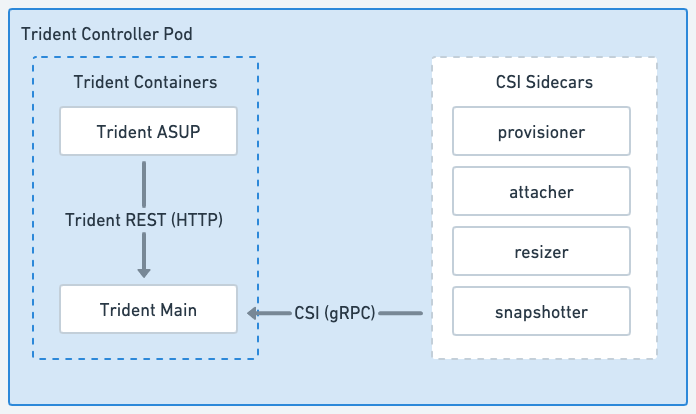

= Astra Trident 架構
:hardbreaks:
:allow-uri-read: 
:icons: font
:imagesdir: ../media/

[role="lead"]
Astra Trident 會在叢集中的每個工作節點上、以單一控制器 Pod 加上節點 Pod 的形式執行。節點 Pod 必須在任何想要裝載 Astra Trident Volume 的主機上執行。

== 瞭解控制器 Pod 和節點 Pod

Astra Trident 部署為單一 <<Trident 控制器 Pod>> 以及一或多個 <<Trident 節點 Pod>> 在 Kubernetes 叢集上、並使用標準 Kubernetes _CSI Sidecar Containers_ 來簡化 CSI 外掛程式的部署。 link:https://kubernetes-csi.github.io/docs/sidecar-containers.html["Kubernetes CSI Sidecar Container"^] 由 Kubernetes 儲存社群維護。

Kubernetes link:https://kubernetes.io/docs/concepts/scheduling-eviction/assign-pod-node/["節點選取器"^] 和 link:https://kubernetes.io/docs/concepts/scheduling-eviction/taint-and-toleration/["容忍和污染"^] 用於限制 Pod 在特定或偏好的節點上執行。您可以在 Astra Trident 安裝期間、為控制器和節點 Pod 設定節點選取器和公差。

* 控制器外掛程式可處理磁碟區資源配置與管理、例如快照和調整大小。
* 節點外掛程式會處理將儲存設備附加至節點的問題。

.Astra Trident 部署在 Kubernetes 叢集上
image::../media/trident-arch.png[Kubernetes 叢集上的 Astra Trident 架構圖表。]

=== Trident 控制器 Pod

Trident 控制器 Pod 是執行 CSI 控制器外掛程式的單一 Pod 。

* 負責在 NetApp 儲存設備中佈建及管理磁碟區
* 由 Kubernetes 部署管理
* 可在控制面或工作節點上執行、視安裝參數而定。

.Trident 控制器 Pod 圖表

=== Trident 節點 Pod

Trident Node Pod 是執行 CSI Node 外掛程式的特殊權限 Pod 。

* 負責裝載和卸載主機上執行的 Pod 儲存設備
* 由 Kubernetes 示範集管理
* 必須在將裝載 NetApp 儲存設備的任何節點上執行

.Trident Node Pod 圖表
image::../media/node-pod.png[使用適用的 CSI sidecar 執行 CSI Node 外掛程式的 Trident Node Pod 圖表。]

== 支援的Kubernetes叢集架構

下列Kubernetes架構支援Astra Trident：

[cols="3,1,2"]
|===
| Kubernetes叢集架構 | 支援 | 預設安裝 

| 單一主機、運算 | 是的  a| 
是的

| 多重主機、運算 | 是的  a| 
是的

| Master、「etcd」、運算 | 是的  a| 
是的

| 主要、基礎架構、運算 | 是的  a| 
是的

|===