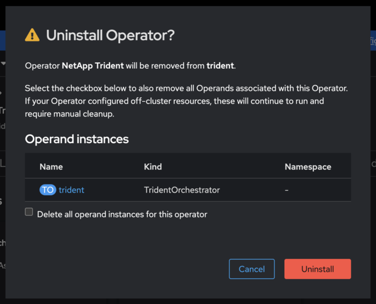

= 從 Trident 社群營運商切換至 OpenShift 認證營運商
:hardbreaks:
:allow-uri-read: 
:icons: font
:imagesdir: ../media/

[role="lead"]
若要從 NetApp 社群 Trident 營運商切換至 Red Hat OpenShift 認證 Trident 營運商，您必須先解除安裝社群營運商，然後使用 OperatorHub 安裝認證營運商。

.開始之前
開始安裝之前link:../trident-get-started/requirements.html/["準備好您的環境以進行 Trident 安裝"]，。

== 解除安裝 NetApp Trident 社群營運者

.步驟
. 使用 OpenShift 主控台瀏覽至 OperatorHub 。
+
image::../media/openshift-operator-05.png[安裝]

. 尋找 NetApp Trident 社群業者。
+

+

WARNING: 請勿選取 * 刪除此運算子的所有運算元執行個體 * 。

. 按一下*解除安裝*。

== 安裝 OpenShift 認證操作員

.步驟
. 瀏覽至 Red Hat OperatorHub 。
. 搜尋並選擇 NetApp Trident 運算子。
+
image::../media/openshift-operator-05.png[安裝]

. 依照畫面上的指示安裝操作人員。

== 驗證

* 檢查主控台的 OperatorHub ，確保已成功安裝新的認證營運者。

