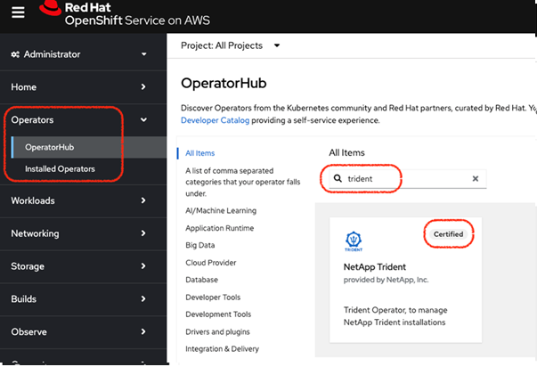

= 使用 OpenShift OperatorHub 安裝 Trident
:hardbreaks:
:allow-uri-read: 
:icons: font
:imagesdir: ../media/

[role="lead"]
如果您使用 Red Hat OpenShift ，則可以使用 Red Hat 認證的營運者來安裝 NetApp Trident 。請使用此程序，從 Red Hat OpenShift Container Platform 安裝 Trident 。

.開始之前
開始安裝之前link:../trident-get-started/requirements.html["準備好您的環境以進行 Trident 安裝"]，。

== 尋找並安裝 Trident 營運商

.步驟
. 瀏覽至 OpenShift OperatorHub 並搜尋 NetApp Trident 。
+

. 按一下「*安裝*」。
+
image::../media/openshift-operator-02.png[安裝]

. 選擇所需的選項，然後按一下 * 安裝 * 。
+
image::../media/openshift-operator-03.png[安裝]

. 安裝完成後，即可在已安裝的操作員清單中看到操作員。
+
image::../media/openshift-operator-04.png[已安裝]

. 建立類似於操作員套件安裝的 Torc 。

== 解除安裝 Trident 運算子

.步驟
. 從已安裝操作員清單中選取 Trident 操作員。
+
image::../media/openshift-operator-05.png[安裝]

. 如果您要從運算子刪除所有的運算元執行個體，請選取此選項。
+
image::../media/openshift-operator-06.png[已安裝]

+

WARNING: 如果未選中 * 刪除此運算符的所有操作數實例 * 複選框，則不會卸載 Trident 。

. 按一下*解除安裝*。

