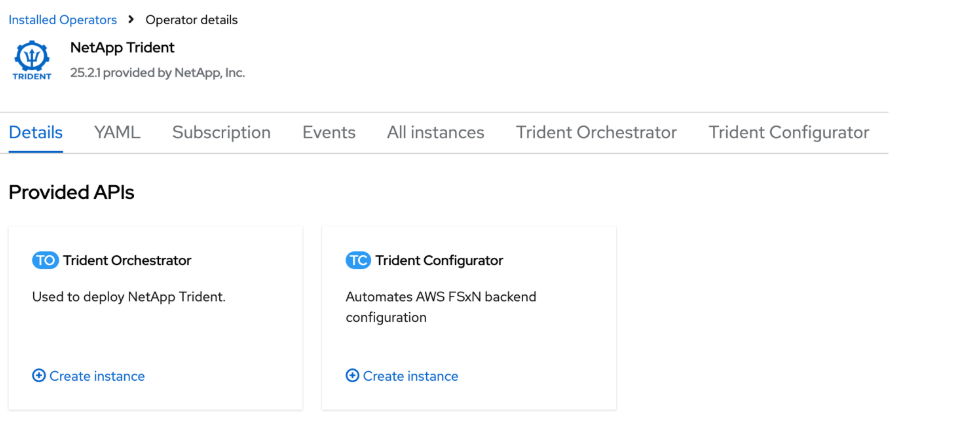

= 使用 OpenShift OperatorHub 安裝 Trident
:hardbreaks:
:allow-uri-read: 
:icons: font
:imagesdir: ../media/

[role="lead"]
如果您使用 Red Hat OpenShift ，則可以使用 Red Hat 認證的營運者來安裝 NetApp Trident 。請使用此程序，從 Red Hat OpenShift Container Platform 安裝 Trident 。

.開始之前
開始安裝之前link:../trident-get-started/requirements.html["準備好您的環境以進行 Trident 安裝"]，。

== 尋找並安裝 Trident 營運商

.步驟
. 瀏覽至 OpenShift OperatorHub 並搜尋 NetApp Trident 。
+
image::../media/openshift-operator-01.png[Trident運算子]

. 點選* NetApp Trident* 開啟安裝設定。
. 選擇所需的選項，然後按一下「*安裝*」以開啟操作員配置。
+
image::../media/openshift-operator-02.png[安裝]

+

NOTE: 請確保選擇最新的 Operator 版本。

. 保留所有參數，然後按一下“*安裝*”。
+
image::../media/openshift-operator-03.png[安裝]

+
安裝完成後，Operator 將顯示在已安裝的 Operator 清單中並可供使用。

. 按一下「查看操作員」以查看操作員的詳細資料。
+
image::../media/openshift-operator-04.png[已安裝]

. 在 * Trident Orchestrator* 下，按一下 *建立實例*。
+

. 按一下「YAML 檢視」並將以下內容貼上到表單中：
+
[source, yaml]
----
apiVersion: trident.netapp.io/v1
kind: TridentOrchestrator
metadata:
  name: trident
  namespace: openshift-operators
spec:
  IPv6: false
  debug: false
  nodePrep:
  - iscsi
  imageRegistry: ''
  k8sTimeout: 30
  namespace: trident
  silenceAutosupport: false
----
+
[]
====
** Red Hat Enterprise Linux CoreOS (RHCOS) 未啟用和設定 iSCSI。
** 您可以新增 `nodePrep`在所有 OpenShift 工作節點上配置和啟用 iSCSI 和 Multipath 服務的參數。
** 從 OpenShift 4.19 開始，此功能支援的最低Trident版本為 25.06.1。

====
. 按一下「建立」； Trident Orchestrator 將會完全安裝。
+
image::../media/openshift-operator-08.png[已安裝]

== 卸載Trident操作員

.步驟
. 從已安裝操作員清單中選取 Trident 操作員。
. 如果您要從運算子刪除所有的運算元執行個體，請選取此選項。
+

WARNING: 如果未選中 * 刪除此運算符的所有操作數實例 * 複選框，則不會卸載 Trident 。

. 按一下*解除安裝*。

