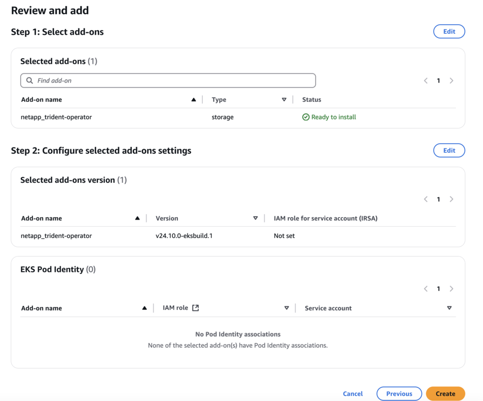

= 在 EKS 叢集上設定 Astra Trident EKS 附加元件
:hardbreaks:
:allow-uri-read: 
:icons: font
:imagesdir: ../media/

[role="lead"]
Trident 簡化了 Kubernetes 中適用於 NetApp ONTAP 儲存管理的 Amazon FSX 、讓開發人員和管理員能夠專注於應用程式部署。Trident EKS 附加元件包含最新的安全性修補程式、錯誤修正、並經過 AWS 驗證、可與 Amazon EKS 搭配使用。EKS 附加元件可讓您持續確保 Amazon EKS 叢集安全穩定、並減少安裝、設定及更新附加元件所需的工作量。

== 先決條件

在設定 AWS EKS 的 Trident 附加元件之前、請確定您具有下列項目：

* 具有附加訂閱的 Amazon EKS 叢集帳戶
* AWS 對 AWS 市場的權限：
`"aws-marketplace:ViewSubscriptions",
"aws-marketplace:Subscribe",
"aws-marketplace:Unsubscribe`
* AMI 類型： Amazon Linux 2 （ AL2_x86_64 ）或 Amazon Linux 2 ARM （ AL2_ARM_64 ）
* 節點類型： AMD 或 ARM
* 現有的 Amazon FSX for NetApp ONTAP 檔案系統

== 步驟

. 在您的 EKS Kubernetes 叢集上、瀏覽至 * 附加元件 * 索引標籤。
+
image::../media/aws-eks-01.png[AWS EKS 01]

. 前往 * AWS Marketplace 附加元件 * 並選擇 _storage 類別。
+
image::../media/aws-eks-02.png[AWS EKS 02]

. 找到 * NetApp Trident * ，然後選取 Trident 附加元件的核取方塊。
. 選擇所需版本的附加元件。
+
image::../media/aws-eks-03.png[AWS EKS 03]

. 選取 IAM 角色選項以從節點繼承。
+

. 展開 * 選用組態設定 * 、遵循 * 附加元件組態架構 * 、並將 * 組態值 * 區段上的組態值參數設定為您在上一個步驟中建立的角色參數（值應採用下列格式： `eks.amazonaws.com/role-arn: arn:aws:iam::464262061435:role/AmazonEKS_FSXN_CSI_DriverRole`）。如果您為衝突解決方法選取「覆寫」、則現有附加元件的一或多個設定可以使用 Amazon EKS 附加元件設定覆寫。如果您未啟用此選項、且與現有設定發生衝突、則作業將會失敗。您可以使用產生的錯誤訊息來疑難排解衝突。選取此選項之前、請確定 Amazon EKS 附加元件不會管理您需要自行管理的設定。
+
image::../media/aws-eks-06.png[AWS EKS 06]

. 選擇* Create *（建立*）。
. 確認附加元件的狀態為 _Active_ 。
+
image::../media/aws-eks-05.png[AWS EKS 05]

== 使用 CLI 安裝 / 解除安裝 Trident EKS 附加元件

.使用 CLI 安裝 Trident EKS 附加元件：
下列範例命令會安裝 Trident EKS 附加元件：
`eksctl create addon --cluster K8s-arm --name netapp_trident-operator --version v24.10.0-eksbuild`
`eksctl create addon --cluster clusterName --name netapp_trident-operator --version v24.10.0-eksbuild.1`（含專用版本）

.使用 CLI 解除安裝 Trident EKS 附加元件：
下列命令會解除安裝 Trident EKS 附加元件：
`eksctl delete addon --cluster K8s-arm --name netapp_trident-operator`
